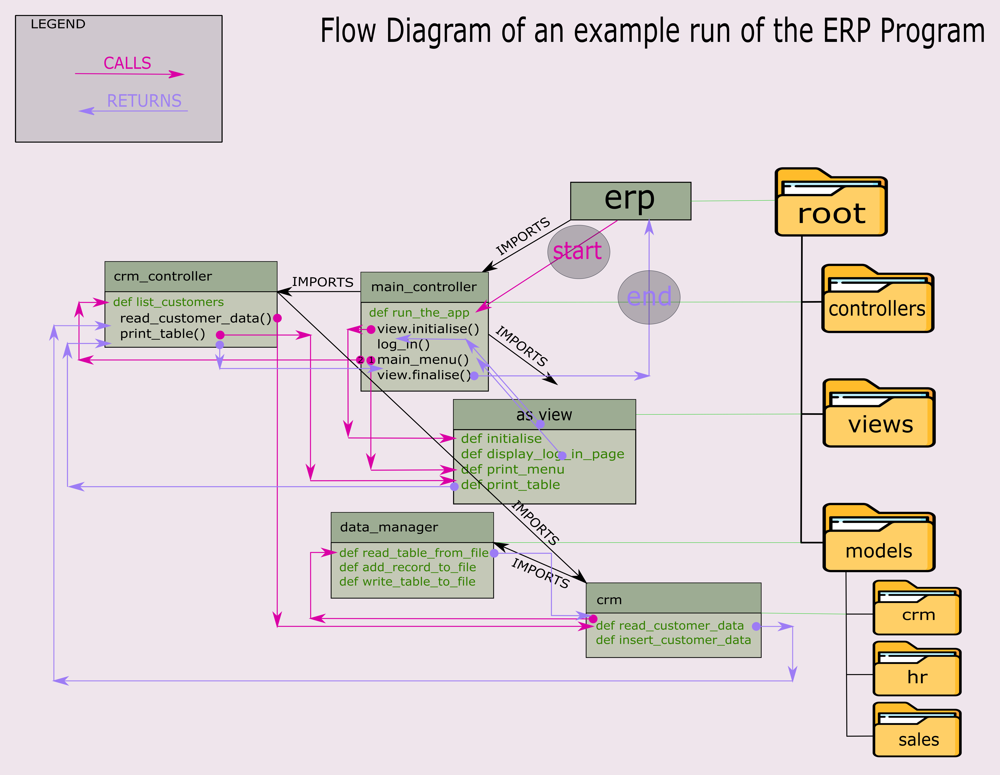

# Secure-ERP

Codecool project in which we use Model View Controller design pattern, Clean Code practices and aim for 100% unit test
coverage of code that doesn't directly take the user input.

# The choices

### Python and python package versioning

Because of the point we are in the course, we are not expected yet to implement any sort of virtual environments to
control versioning of Python and python packages. Therefore, we didn't implement it. We may create a list
that present the versions of the packages used by team to run the software successfully. Look for it in the root of the
repo going by a standard name of `requirements.txt`.

# How to Run the app

open erp.py with python 3 in terminal. Depending on your system you may need to use different commands, some options
include:

```
.../Secure-ERP> py ./erp.py
```

```
.../Secure-ERP> python3 ./erp.py
```

```
.../Secure-ERP> python ./erp.py
```

```
.../Secure-ERP> py3 ./erp.py
```

You can run the program providing to python in the command either:

- relational path (like in the examples above), or
- an absolute path, e.g.
    - "/home/example/foo/file.txt" on Linux, or
    - "C:\Users\username\OneDrive - The Organisation\Documents\example\file.txt" on Windows

Remember to surround the path with quotes if it uses spaces.

Use the relational path as in the example above if you start from the project's root directory in the terminal. If you
start from any different directory, and you can relationally navigate to the root of the project where the erp.py file
resides, the relational call is also possible.

From any directory on your system you can call the python to run the erp.py providing the absolute path to the erp.py
file.

# Unit tests

Unit tests use the pytest module to run the unit tests. In the root directory of the project you can find the
pytest.ini, which is the configuration file for the pytest. If you run the pytest from terminal being in that root
directory of the project, the pytest should automatically detect the configuration file and use it. The `pytest.ini`
specifies the minimum version of pytest that should run the tests by setting the `minversion = 7.1`, which in this case
specifies the minimal version to be 7.1.
`addopts` variable sets the flags/arguments that the pytest is being run with, e.g. `addopts = -ra` tells the pytest to
report all tests.
`testpaths` tells pytest where to find the tests relational to the root directory (in which the pytest.ini is placed).
Test paths can be separated by a new line in the `pytest.ini` file, like:

```
testpaths =
    tests
    integration
```

## How to Run the unit tests

To run the unit tests, you first need to have pytest installed. Then from the terminal, if needed, first change the 
directory to the root of the "Secure-ERP" project. Then, depending on your system, and its configuration with the python 
ecosystem, you can either run pytest using the `pytest` command directly or first calling python in your terminal, e.g.
`py`/`py3`/`python`/`python3` etc. with a flag `-m` and providing package name `pytest`, which in result looks like:

```
py -m pytest
```

pytest should detect the `pytest.ini` configuration file that is in the root of the project and set up the test
accordingly. According to the configuration file it should start looking in the `./tests` directory for tests to be run.


# Where are we with the project

## Current state of affairs
As of now (I am writing it 23/07/2022) we are arguably halfway to the finish line of the project. 
I am proud to announce that I tried my best to keep the code clean and the structure logical. I adhered to the MVC 
design pattern in this project and divided the structure. I learned to use unit testing with pytest and 
got myself a bit acquainted with unittest module. I want to thank my team, especially Kris for trying out and 
comparing two graphical interfaces from an angle of applying it to our project: pygame and tkinter.
pushing to 
use 
graphical interface tkinter in our project because that made me learn a new thing quickly, which made my thinking 
more flexible.

### What has been implemented so far is as follows:
- Separation of concerns to Model, View and Controller as per MVC design pattern,
- Reading from, and writing to .csv files and converting data to a format iterable by the program (list of lists),
- Formatting and printing out to the terminal a table of clients' data.
- A Button image in asparagus style (I hope you like it).

### Things to be done:
- GUI Log-in form.
- Printing out to the GUI window a table (python's list of lists or two-dimensional list)

## The not so problematic imports and a kind of walk-through
We start at `erp.py` file in the root directory. From the start of our application we encounter a call of a function 
that is in one of the controllers. The `main_controller`. Why such a placement? - we may think. Couldn't the app 
start from the `main_controller` directly? This placement is because of the imports. After importing a module to the 
`erp` (root directory), that imported package works as though it was placed literally in the root, because when we 
try to import something from inside that imported to the root package it now needs to be imported relative to the 
root directory! Which is convenient. We can import views and models from the directories down the tree to the 
controllers that themselves have their own directory. And we do it always with the imports relative to the root 
because anything that is run in this program is directly or indirectly imported to the erp.py in the very root of 
the repository. As you see we can do that without any hustle with changing `os.path` and 
similar, worse, things.

### The flow logic of the program
If you analyse imports in the files it all agrees. All of them are relative to the root of repo. In fact we cannot 
import going to the directory backwards (i.e. the directory above) in Python. Or not without hacking paths around. 
Below you find a flow diagram which you help you in acquainting yourself with the project structure. 
Good luck!




## Further development
Beyond of what we already have done, we still lack some core functionalities of the program to be developed. Some 
include defining more helper function around the functionality, others will reuse functions that are written already.

#### Starting screen: 
- _Ola's suggestion:_ 
  - _quick solution:_ logging-in form without verification. 
  - _potential:_ that could develop (if we had more time) into an IAM (Identity and Access Management. 
    Depending on the role of a person in the company, access to some operations would be different. For example a shop 
    worker may be able to search for a certain client in the database and would see a subset of that client's data. The 
    range of that data may then depend on the operation the worker wants to perform on the customer. The worker 
    would not be able to see a list of all the customers though, because his role would not give the worker access 
    to the function that would list the clients (or any other one that would expose the worker to that data).

#### CRM: Customer Relationship Management:
- update customer:
  - fetch the customer's data (search for a particular client): needs to be implemented.
    - How? 
      - __option 1:__ Let the user choose in which column to look for: Name or e-mail or id.
      look for the entry which includes the string input from the user.
      For the GUI in tkinter we may want to take a look at either 
      [ttk.Combobox](https://docs.python.org/3/library/tkinter.ttk.html#combobox) or 
      [ttk.Spinbox](https://docs.python.org/3/library/tkinter.ttk.html#spinbox) to circle a list of headers (defined 
        as `CUSTOMER_TABLE_HEADERS` in `model/crm/crm.py`)
      - __option 2:__ Go through every cell in the customers table and check for the cell that includes the string input
      from the user.
  
      You can use the in operator or the string's find method to check if a string contains another string. The `in` 
    operator returns True if the substring exists in the string. Otherwise, it returns False. The find method returns 
    the index of the beginning of the substring if found, otherwise -1 is returned. There's also regex. For our 
    purposes, usage of the `in` keyword would be enough. 
  - Get the user to approve that the found record is indeed the customer he wants to update.
  - If yes, ask for the new data, if not let the user know that nothing has been found and repeat the search.
  - Update the record with new data. Be careful not to overwrite the whole file during the opening. See [this stack 
    overflow post](https://stackoverflow.com/questions/46126082/how-to-update-rows-in-a-csv-file)
    
- delete customer

#### HR: Human Resources
We need to write everything in here.

#### SALES
We need to develop every function in this module as well.